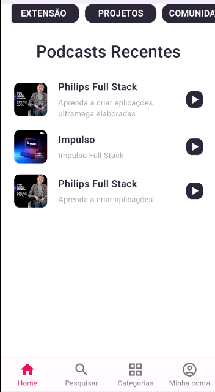

# Aplicativo de Podcast 

Projeto desenvolvido com base no projeto de lab da digital inovation one, e que pode ser replicado seguindo o 
seguinte [curso](https://web.dio.me/lab/criando-um-app-de-podcast-multiplataforma-com-flutter).

O Projeto foca na aprendizagem dos componenetes básico do flutter, explorando apenas a superfície do que o framework disponibiliza. 

Foi utilizado imagens e componenetes fornecidos pelo próprio lab.

## Some Flutter auto-generated text...

- [Lab: Write your first Flutter app](https://docs.flutter.dev/get-started/codelab)
- [Cookbook: Useful Flutter samples](https://docs.flutter.dev/cookbook)

For help getting started with Flutter development, view the
[online documentation](https://docs.flutter.dev/), which offers tutorials,
samples, guidance on mobile development, and a full API reference.
